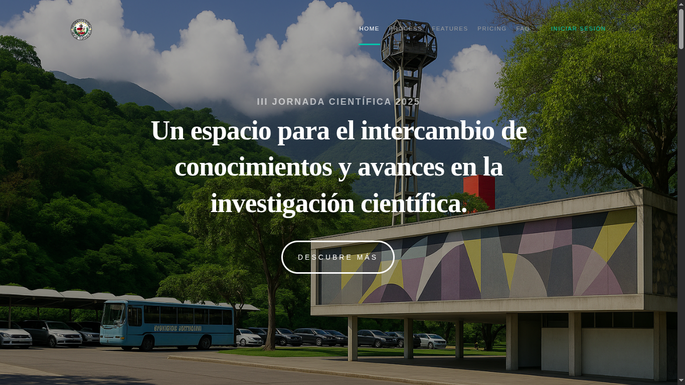

# III JORNADA CIENTÍFICA 2025



Bienvenido al sitio web oficial de la III Jornada Científica 2025, un espacio dedicado al intercambio de conocimientos y avances en la investigación científica.

## 📋 Descripción

La Jornada Científica 2025 es un evento académico que reúne a investigadores, profesionales y estudiantes para compartir experiencias, resultados de investigación y avances en diversas áreas del conocimiento científico. Este año, bajo el lema "Un espacio para el intercambio de conocimientos y avances en la investigación científica", buscamos fomentar la colaboración interdisciplinaria y el desarrollo de nuevas ideas innovadoras.

## 🚀 Características Principales

- **Programa Científico**: Conferencias magistrales, presentaciones orales y sesiones de pósteres.
- **Red de Contactos**: Oportunidad de conectar con profesionales y expertos en diversas áreas.
- **Temas de Vanguardia**: Discusión sobre las últimas tendencias e investigaciones científicas.
- **Participación Internacional**: Contamos con la presencia de destacados ponentes nacionales e internacionales.

## 🛠️ Tecnologías Utilizadas

- **Frontend**: HTML5, CSS3, JavaScript
- **Diseño**: Responsive Design, Mobile-First
- **Control de Versiones**: Git
- **Hosting**: [Especificar si es relevante]

## 🚀 Cómo Empezar

### Requisitos Previos

- Navegador web moderno (Chrome, Firefox, Safari, Edge)
- Conexión a Internet

### Instalación Local

1. Clona el repositorio:
   ```bash
   git clone [URL_DEL_REPOSITORIO]
   ```
2. Navega al directorio del proyecto:
   ```bash
   cd landing-jornada-2025
   ```
3. Abre el archivo `index.html` en tu navegador.

## 🎨 Estructura del Proyecto

```
landing-jornada-2025/
├── assets/
│   ├── css/
│   │   └── main.css
│   ├── js/
│   └── images/
│       └── banner-jornada-cientifica.jpg
├── index.html
└── README.md
```

## 🤝 Cómo Contribuir

Las contribuciones son bienvenidas. Por favor, lee nuestras [pautas de contribución](URL_DE_LAS_PAUTAS) antes de enviar un pull request.

## 📄 Licencia

Este proyecto está bajo la Licencia [NOMBRE_DE_LA_LICENCIA]. Para más detalles, consulta el archivo `LICENSE`.

## 📧 Contacto

Para más información, contáctanos en [correo@ejemplo.com](mailto:correo@ejemplo.com)

---

<div align="center">
  <p>© 2025 Jornada Científica. Todos los derechos reservados.</p>
</div>
